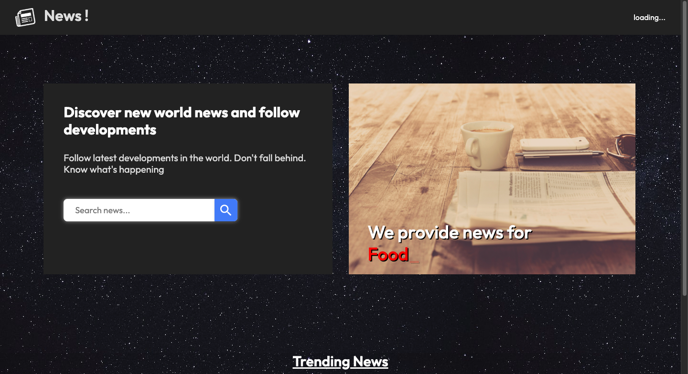

# 📰 NewsLetter

A modern, full-stack newsletter platform for discovering, reading, and sharing curated news and articles. Built for HackNiche 2024.

[Live Demo 🚀](https://hackniche-404notfound.vercel.app/)

---

## Table of Contents

- [Overview](#overview)
- [Features](#features)
- [Tech Stack](#tech-stack)
- [Getting Started](#getting-started)
- [Project Structure](#project-structure)
- [Contributing](#contributing)
- [License](#license)

---



---

## Overview

**NewsLetter** is a web application designed to streamline the process of subscribing to, reading, and sharing newsletters. Users can explore trending topics, read the latest articles, and manage their subscriptions-all from a clean, responsive interface.

This project was developed as part of the HackNiche 2024 hackathon and demonstrates a robust, scalable approach to content curation and distribution.

---

## Features

- 📰 **Curated Newsletters:** Browse and read from a selection of curated newsletters and articles.
- 🔍 **Search \& Discover:** Find newsletters by topics, keywords, or authors.
- 📬 **Subscription Management:** Subscribe or unsubscribe to newsletters with a single click.
- 🧑‍💻 **User Authentication:** Secure sign-up and login functionality.
- 📈 **Analytics:** Track reading history and engagement (future scope).
- 💻 **Responsive Design:** Optimized for desktop and mobile devices.

---

## Tech Stack

- **Frontend:** React.js, CSS, HTML
- **Backend:** Node.js, Express.js
- **Database:** MongoDB (via Mongoose)
- **Hosting:** Vercel (Frontend), Render/Heroku (Backend)
- **APIs:** Custom RESTful endpoints

---

## Getting Started

### Prerequisites

- Node.js (v14+)
- npm or yarn
- MongoDB (local or Atlas)


### Installation

1. **Clone the repository:**

```bash
git clone https://github.com/AayushPatel006/NewsLetter.git
cd NewsLetter
```

2. **Backend Setup:**

```bash
cd backend
npm install
# Configure your MongoDB URI and environment variables in .env
npm start
```

3. **Frontend Setup:**

```bash
cd ../frontend
npm install
npm start
```

4. **Access the App:**
    - Visit `http://localhost:3000` in your browser.

> **Note:** For production, the app is deployed at [hackniche-404notfound.vercel.app](https://hackniche-404notfound.vercel.app/).

---

## Project Structure

```
NewsLetter/
├── backend/           # Node.js backend (API, DB models)
├── frontend/          # React.js frontend
├── serverless-hosting/ # Deployment configs
├── .gitignore
├── README.md
└── ...
```

--
## Contributors

1. Aayush Patel [linkedin](https://www.linkedin.com/in/aayushpatel006/) [github](https://github.com/aayushPatel006)
2. Omkar Bhoir [linkedin](https://www.linkedin.com/in/omkar-bhoir/) [github](https://github.com/omkar787)
3. Tejas Jadhav [linkedin](https://www.linkedin.com/in/the-tejas-jadhav/) [github](https://github.com/string-tejas)
4. Varshil Shah [linkedin](https://www.linkedin.com/in/shahvarshil/) [github](https://github.com/varshil-shah) 

---

## Contributing

Contributions are welcome!
To contribute:

1. Fork the repository
2. Create a new branch (`git checkout -b feature/your-feature`)
3. Commit your changes (`git commit -m 'Add some feature'`)
4. Push to the branch (`git push origin feature/your-feature`)
5. Open a Pull Request

---

## License

This project is for educational and demonstration purposes.

---

**Made with ❤️ for HackNiche 2024**

---
